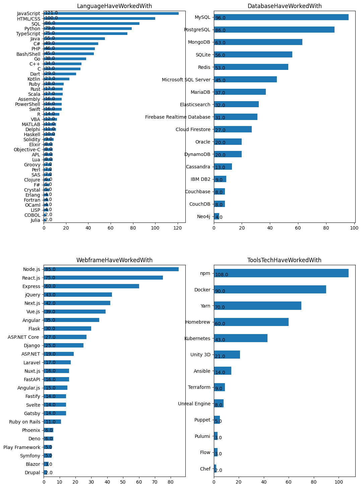
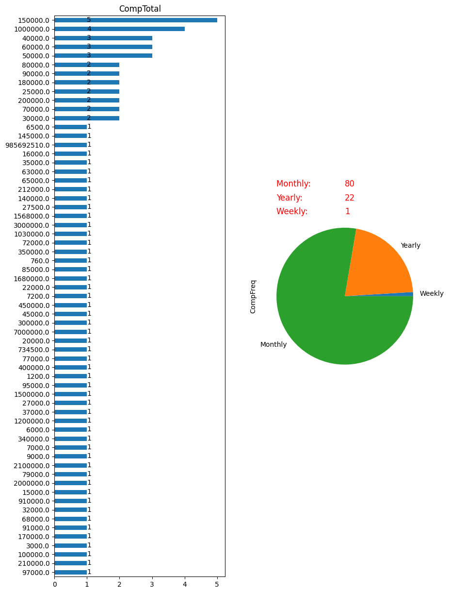

## Table of Contents

- [Description](#description)
- [Dependencies](#dependencies)
- [Installing](#installing)
- [Screenshots](#screenshots)

## Description

For this project, create a blog post and Github repository to begin building a data science portfolio. 

- Come up with three questions you are interested in answering.
- Extract the necessary data to answer these questions.
- Perform necessary cleaning, analysis, and modeling.
- Evaluate your results.
- Share your insights with stakeholders in a blog post.

## Goal

Using these columns from the dataframe, I will answer 4 questions

- What is the required programming language use most in Thailand?
- What is the required web framework use most in Thailand?
- What is the required database use most in Thailand?
- What are the required tools and technologies use most in Thailand?

## Files
- /data1/developer_survey_2020/survey_results_public.csv
- /data1/developer_survey_2020/survey_results_schema.csv
- /data1/developer_survey_2020/README_2020.txt


## Dependencies

requirements.txt

- pandas
- numpy
- matplotlib
- seaborn


## Installing Dependencies

```
python -m venv myenv

# for windows
myenv\Scripts\activate.bat

# for linux and macOS
source myenv/bin/activate

pip install -r requirements.txt
```


## Screenshots





