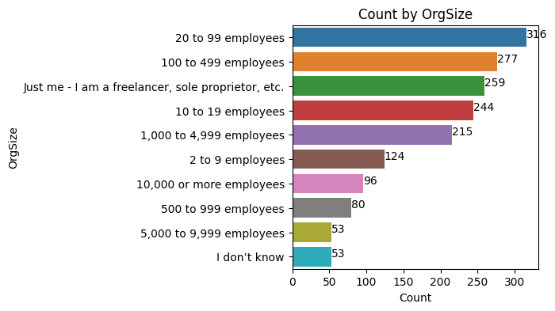
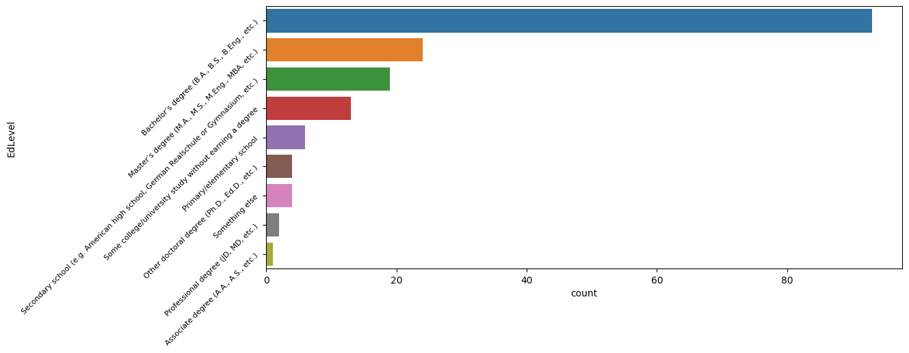

# Table of Contents

- [Description](#description)
- [Goal](#goal)
- [Files](#files)
- [Dependencies](#dependencies)
- [Installing](#installing)
- [Screenshots](#screenshots)

# Description

https://medium.com/@x64amd/analyze-stack-overflows-2022-survey-for-programmers-who-are-in-thailand-ad196105146a

For this project, create a blog post and Github repository to begin building a data science portfolio. 

- Come up with three questions you are interested in answering.
- Extract the necessary data to answer these questions.
- Perform necessary cleaning, analysis, and modeling.
- Evaluate your results.
- Share your insights with stakeholders in a blog post.

Guide line to follow: CRISP-DM (Cross-Industry Standard Process for Data Mining) 
 - Business Understanding
 - Data Understanding
 - Data Preparation
 - Modeling
 - Evaluation
 - Deployment


# Goal
Using these columns from the dataframe, I will answer these questions

- What is the required programming language use most in Thailand?
- What is the required web framework use most in Thailand?
- What is the required database use most in Thailand?
- What are the required tools and technologies use most in Thailand?
 
 - Analyze the demographics data
 - Analyze the salary data


# Files
- /data1/survey_results_public.csv - the full results of the 2020 Stack Overflow Developer Survey in CSV format
- /data1/survey_results_schema.csv - description of the 'structure' of the data in CSV format
- /data1/README_2020.txt - description of the data
- /screenshots - screenshots of the results
- commands.txt - frequently used commands
- requirements.txt - list of dependencies that needs to be installed
- helper1.py - my own functions
- m2.ipynb - main jupyter notebook
- back.ipynb - backup of m2.ipynb


# Dependencies
requirements.txt

- pandas
- numpy
- matplotlib
- seaborn, 'seasborn' uses matplotlib


# Installing Dependencies
```
python -m venv myenv

# for windows
myenv\Scripts\activate.bat

# for linux and macOS
source myenv/bin/activate

pip install -r requirements.txt
```


# Screenshots




# Acknowledgements

Data from Stack Overflow Developer Survey (2022)
https://insights.stackoverflow.com/survey


